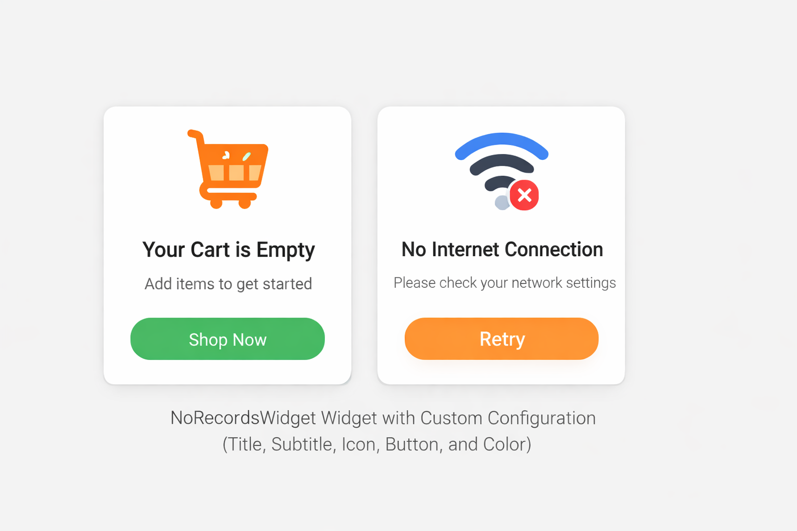

## NoRecordsWidget (Android Kotlin Library)

A lightweight and fully customizable **No Records Found / Empty State Widget** for Android apps.

This library helps you easily display professional empty screens like:

✅ No Data Found  
✅ No Orders Yet  
✅ No Internet Connection  
✅ Empty Cart  
✅ No Search Results  

With support for **custom XML attributes** and optional Retry button.

---

### Preview

Below is example of widgets that can be built using this library:



---

### Features

-  Simple plug-and-play empty state widget  
-  Custom title and subtitle text  
-  Custom icon support  
-  Optional Retry button  
-  Retry button background color customization  
-  Works directly in XML  
-  Lightweight and beginner-friendly  
-  Kotlin-based modern Android library  

---

## Installation (JitPack)

### 1️⃣ Add JitPack to your **root `settings.gradle` or `build.gradle`**

```gradle
dependencyResolutionManagement {
    repositories {
        google()
        mavenCentral()
        maven { url 'https://jitpack.io' }
    }
}
```
### Add Dependency
```
	dependencies {
	        implementation 'com.github.Excelsior-Technologies-Community:Android_CustomDotIndicator:1.0.0'
	}
```

---

### Usage

Add Widget in XML Layout
```xml
<com.ext.norecordswidget.NoRecordsView
    android:id="@+id/noRecordsView"
    android:layout_width="match_parent"
    android:layout_height="match_parent"

    app:titleText="No Orders Found"
    app:subtitleText="Please place your first order"

    app:iconSrc="@drawable/ic_empty"

    app:showRetryButton="true"
    app:retryButtonText="Try Again"
    app:retryButtonBgColor="#FF9800"/>
```

Handle Retry Button Click in Activity
```xml
val noView = findViewById<NoRecordsView>(R.id.noRecordsView)

noView.setOnRetryClick {
    Toast.makeText(this, "Retry clicked!", Toast.LENGTH_SHORT).show()
}
```

### Customization Attributes

You can customize the widget directly from XML using the following attributes:

| Attribute | Type | Description |
|----------|------|-------------|
| `titleText` | String | Sets the main title text |
| `subtitleText` | String | Sets the subtitle/description text |
| `iconSrc` | Reference | Sets a custom icon drawable |
| `showRetryButton` | Boolean | Shows or hides the retry button |
| `retryButtonText` | String | Sets the retry button label text |
| `retryButtonBgColor` | Color | Sets the retry button background color |

---

### License

```
MIT License

Copyright (c) 2025 Excelsior Technologies 

Permission is hereby granted, free of charge, to any person obtaining a copy
of this software and associated documentation files (the "Software"), to deal
in the Software without restriction, including without limitation the rights
to use, copy, modify, merge, publish, distribute, sublicense, and/or sell
copies of the Software, and to permit persons to whom the Software is
furnished to do so, subject to the following conditions:

The above copyright notice and this permission notice shall be included in all
copies or substantial portions of the Software.

THE SOFTWARE IS PROVIDED "AS IS", WITHOUT WARRANTY OF ANY KIND, EXPRESS OR
IMPLIED, INCLUDING BUT NOT LIMITED TO THE WARRANTIES OF MERCHANTABILITY,
FITNESS FOR A PARTICULAR PURPOSE AND NONINFRINGEMENT. IN NO EVENT SHALL THE
AUTHORS OR COPYRIGHT HOLDERS BE LIABLE FOR ANY CLAIM, DAMAGES OR OTHER
LIABILITY, WHETHER IN AN ACTION OF CONTRACT, TORT OR OTHERWISE, ARISING FROM,
OUT OF OR IN CONNECTION WITH THE SOFTWARE OR THE USE OR OTHER DEALINGS IN THE
SOFTWARE.
```
